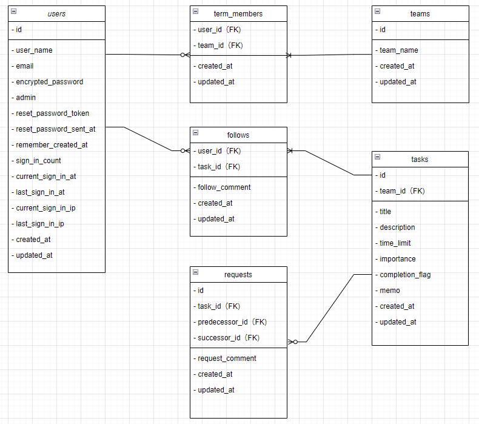
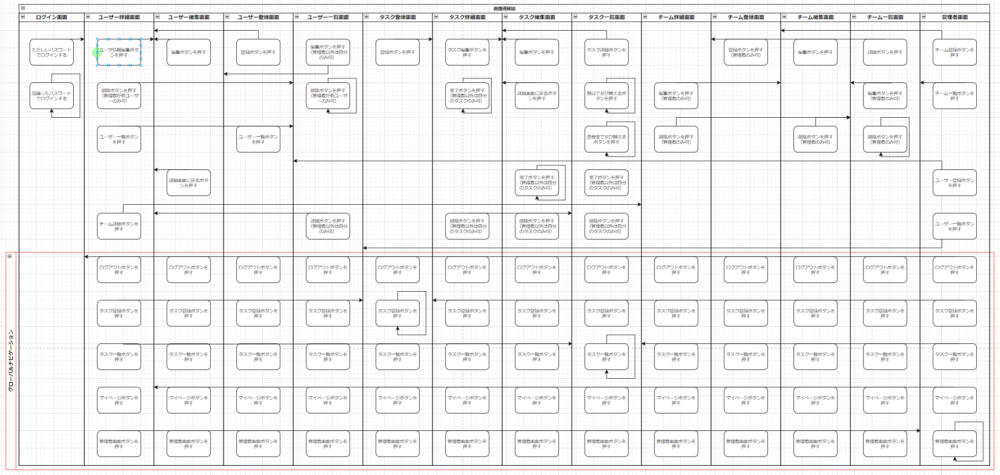

# README

# 開発言語
- ruby on rails (6.1.6.1)
- Ruby (3.0.1)

# アプリケーションに取り入れる技術
- AWS 
- devise

# カリキュラム外でアプリに取り入れる技術
- ransack

# アプリケーション実行手順
```
git clone git@github.com:progate2222/smooth.git
bundle install
rails webpacker:install
rails db:create
rails db:migrate
rails s
```

# ドキュメント類の共有リンク
## カタログ設計書、テーブル定義書、チェックリストなど
https://docs.google.com/spreadsheets/d/1tD8-UBNSoiBuu0djIhnoNxQgzm4N_QjG4D0yQCCcgs8/edit#gid=492690124

## ワイヤーフレーム
https://www.figma.com/file/6yI9sWwbEPCvsCCpGgETEg/Untitled?node-id=0%3A1

# ER図


# 画面遷移図

